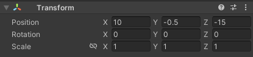
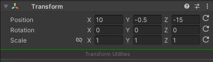
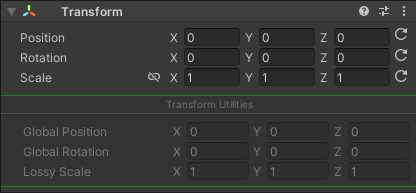
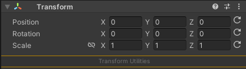
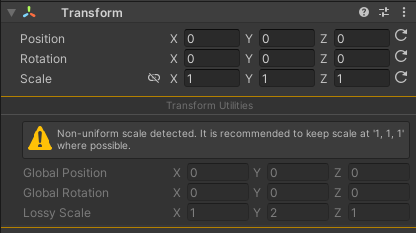
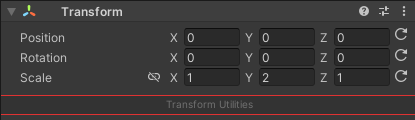
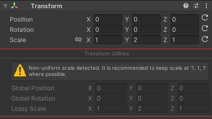

# Unity Default Transform

# Unity - Extended Transform Editor

Extends the default Unity Transform inspector to include additional functionality:
- Reset buttons.
- Non-uniform scale warning.
- View Global Position / Rotation / Scale as ReadOnly.

